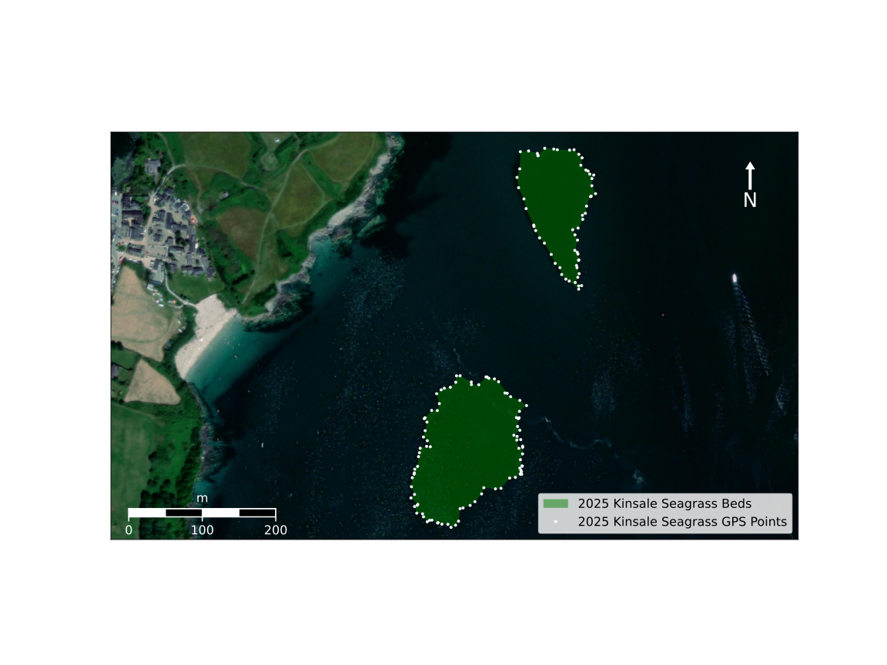

# Plot Seagrass beds

Example usage:

``` bash
python3 kinsale.py kinsale.svg '2025 Kinsale Seagrass Beds' '2025 Kinsale Seagrass GPS Points' 51.692964 -8.514212 51.699164 -8.502212 southern.gpx northern.gpx
```


